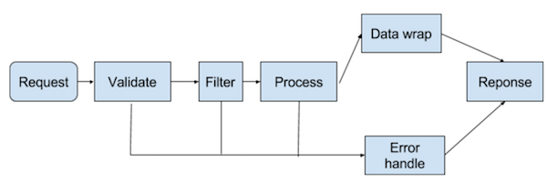

# routs

基于JSON的路由配置方案

## 目标

* 直观的路由配置
* 方便测试
* 自动生成前端服务模板(angular, redux ...) [WIP]



## 安装

` npm i routs `

## 配置

[demo](example)

yoeman scaffold: [asn](https://github.com/sankooc/generator-asn)


### 路由配置

#### router config

```

{
  path: '/akb',
  routes: [], //routing config
  filters: [], // filters
}

```

#### routing config

```

{
  path: '/excel',
  match: 'print', 
  filters: ['auth'], //optional
  validate: 'vdata', //optional 
  method: 'post', //optional default is get 
  ext: 'excel', //optional default is json
  alias: 'download', // optional template service name
  desc: 'download excel file' // optional template service comments
}

```

| field     | value  | optional | routing/router |      desc       |   
|-----------|--------|----------|----------------|-----------------|
| path      | string |   false  |   true/true    |   routing path  |
| filters   | string |   true   |   true/true    | route filtering |
| routes    | array  |   false  |  false/true    |   sub routings  |
| match     | string |   false  |  true/false    | routing handle  |
| method    | string |   true   |  true/false    | routing method (post, put, get, delete, default is get) |
| ext       | string |   true   |  true/false    | response format |
| alias     | string |   true   |  true/false    | routing alias   |
| desc      | string |   true   |  true/false    | routing desc    |

生成模板服务时alias必须设置


## 生成模板代码

### angular1 service

` ng1 [config file] [folder] `